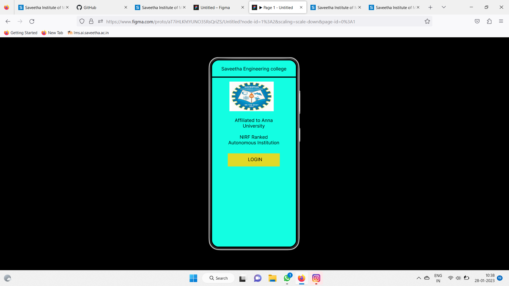
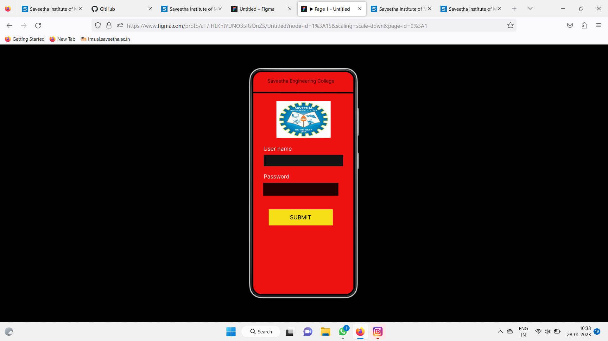
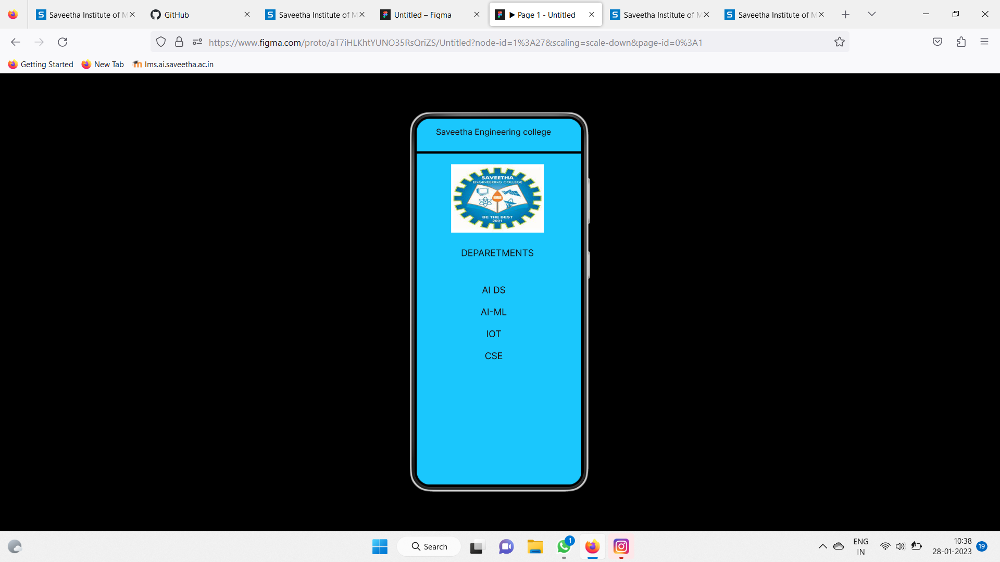

# Event Registration Web Application

## AIM:
To design, develop and deploy a web application for event registration.

## DESIGN STEPS:

### Step 1:
Create a new frame.

### Step 2:
Select any one preset size of your choice.

### Step 3:
Select the shapes you need.

### Step 4:
Import images as needed.

### Step 5:
Create pages based on your need and link them.

### Step 6:

Validate the HTML and CSS code.

### Step 6:

Publish the website in the given URL.

## DESIGN TOOL:
Figma

## CODE:
```
/* Saveetha Engineering college */

position: absolute;
width: 328px;
height: 50px;
left: 16px;
top: 25px;

font-family: 'Inter';
font-style: normal;
font-weight: 400;
font-size: 20px;
line-height: 24px;
text-align: center;

color: #000000;


/* Saveetha Engineering college */

position: absolute;
width: 328px;
height: 50px;
left: 16px;
top: 25px;

font-family: 'Inter';
font-style: normal;
font-weight: 400;
font-size: 20px;
line-height: 24px;
text-align: center;

color: #000000;


/* Line 1 */

position: absolute;
width: 360px;
height: 0px;
left: 0px;
top: 75px;

border: 5px solid #000000;


/* logo 1 */

position: absolute;
width: 190px;
height: 127px;
left: 75px;
top: 92px;

background: url(logo.jpg);


/* logo 2 */

position: absolute;
width: 190px;
height: 127px;
left: 75px;
top: 92px;

background: url(logo.jpg);


/* Rectangle 1 */

position: absolute;
width: 223px;
height: 56px;
left: 68px;
top: 400px;

background: #E0D927;


/* LOGIN */

position: absolute;
width: 174px;
height: 32px;
left: 98px;
top: 414px;

font-family: 'Inter';
font-style: normal;
font-weight: 400;
font-size: 20px;
line-height: 24px;
text-align: center;

color: #000000;


/* Affiliated to Anna University NIRF Ranked Autonomous Institution */

position: absolute;
width: 264px;
height: 120px;

font-family: 'Inter';
font-style: normal;
font-weight: 400;
font-size: 20px;
line-height: 24px;
text-align: center;

color: #000000;


/* Line 2 */

position: absolute;
width: 360px;
height: 0px;
left: 0px;
top: 77px;

border: 5px solid #000000;
transform: rotate(0.16deg);


/* logo 3 */

position: absolute;
width: 194.58px;
height: 132.01px;
left: 83.65px;
top: 105.75px;

background: url(logo.jpg);
transform: rotate(-0.09deg);


/* Rectangle 2 */

position: absolute;
width: 285px;
height: 41px;
left: 38px;
top: 299px;

background: #151414;


/* Rectangle 3 */

position: absolute;
width: 270px;
height: 46px;
left: 36px;
top: 400px;

background: #1F0101;


/* User name */

position: absolute;
width: 218px;
height: 34px;
left: 37px;
top: 265px;

font-family: 'Inter';
font-style: normal;
font-weight: 400;
font-size: 20px;
line-height: 24px;

color: #FFFFFF;


/* Password */

position: absolute;
width: 268px;
height: 26px;
left: 38px;
top: 365px;

font-family: 'Inter';
font-style: normal;
font-weight: 400;
font-size: 20px;
line-height: 24px;

color: #FFFFFF;


/* Rectangle 4 */

position: absolute;
width: 230px;
height: 58px;
left: 56px;
top: 495px;

background: #F5DF18;


/* SUBMIT */

position: absolute;
width: 77px;
height: 24px;
left: 132px;
top: 512px;

font-family: 'Inter';
font-style: normal;
font-weight: 400;
font-size: 20px;
line-height: 24px;

color: #000000;


/* Saveetha Engineering college */

position: absolute;
width: 280px;
height: 24px;

font-family: 'Inter';
font-style: normal;
font-weight: 400;
font-size: 20px;
line-height: 24px;
text-align: center;

color: #000000;


/* Line 3 */

position: absolute;
width: 360px;
height: 0px;
left: 0px;
top: 77px;

border: 5px solid #000000;


/* logo 4 */

position: absolute;
width: 202px;
height: 150px;
left: 76px;
top: 100px;

background: url(logo.jpg);


/* DEPARETMENTS */

position: absolute;
width: 160px;
height: 24px;
left: 97px;
top: 282px;

font-family: 'Inter';
font-style: normal;
font-weight: 400;
font-size: 20px;
line-height: 24px;
text-align: center;

color: #151414;


/* AI DS AI-ML IOT CSE */

position: absolute;
width: 58px;
height: 168px;
left: 140px;
top: 363px;

font-family: 'Inter';
font-style: normal;
font-weight: 400;
font-size: 20px;
line-height: 24px;
text-align: center;

color: #200303;


/* Line 4 */

position: absolute;
width: 23.54px;
height: 0px;
left: 180px;
top: 430px;

border: 1px solid #000000;
transform: rotate(167.74deg);


/* Saveetha Engineering college */

position: absolute;
width: 280px;
height: 24px;

font-family: 'Inter';
font-style: normal;
font-weight: 400;
font-size: 20px;
line-height: 24px;
text-align: center;

color: #000000;
```
## OUTPUT:







## RESULT:
The program to design, develop and deploy a web application for event registration is completed successfully.